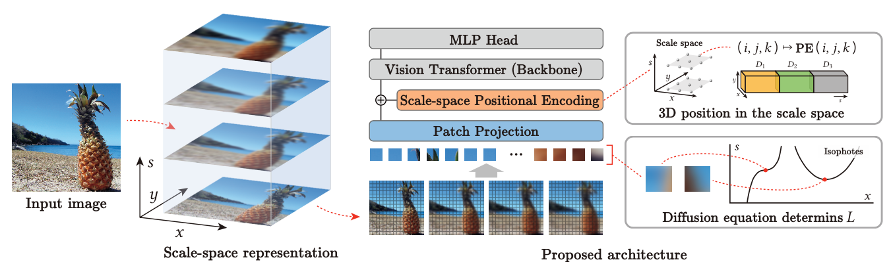

## SRVT: **Scale-space Tokenization for Improving the Robustness of Vision Transformers**

Our paper has been accepted for ACM Multimedia 2023. The code will be released shortly.

[Paper](https://dl.acm.org/doi/10.1145/3581783.3612060)

[Poster](SRVT_ACM-MM23_Poster.pdf)

# Abstract

The performance of the Vision Transformer (ViT) model and its  variants in most vision tasks has surpassed traditional Convolutional Neural Networks (CNNs) in terms of in-distribution accuracy. However, ViTs still have significant room for improvement in their robustness to input perturbations. Furthermore, robustness is a critical aspect to consider when deploying ViTs in real-world scenarios. Despite this, some variants of ViT improve the in-distribution accuracy and computation performance at the cost of sacrificing the model's robustness and generalization. In this study, inspired by the prior findings on the potential effectiveness of shape bias to robustness improvement and the importance of multi-scale analysis, we propose a simple yet effective method, scale-space tokenization, to improve the robustness of ViT while maintaining in-distribution accuracy. Based on this method, we build Scale-space-based Robust Vision Transformer (SRVT) model. Our method consists of scale-space patch embedding and scale-space positional encoding. The scale-space patch embedding makes a sequence of variable-scale images and increases the model's shape bias to enhance  its robustness. The scale-space positional encoding implicitly boosts the model's invariance to input perturbations by incorporating scale-aware position information into 3D sinusoidal positional encoding. We conduct experiments on image recognition benchmarks (CIFAR10/100 and ImageNet-1k) from the perspectives of in-distribution accuracy, adversarial and out-of-distribution robustness. The experimental results demonstrate our method's effectiveness in improving robustness without compromising in-distribution accuracy. Especially, our approach achieves advanced adversarial robustness on ImageNet-1k benchmark compared with state-of-the-art robust ViT.


# SRVT Architecture



The overview of the proposed method. 

For details see our paper "Scale-space Tokenization for Improving the Robustness of Vision Transformers".

**Tokenization in the scale space.** 

(x, y) indicate the spatial axes.    
s indicates the scale axis. 

**The proposed architecture.** 

Multiple-scale patches are fed into a projection layer followed by the module to add the 3D position embedding. The backbone architecture is the vision transformer. The MLP head is applied to the output of the backbone to perform classification.


# **Experiment Results**

Comparison with state-of-the-art Robust Vision Transformer (RVT) model on CIFAR10/100, ImageNet-1k

## CIFAR10

|     Model      | CIFAR10(Top-1) |  FGSM↑   |   PGD↑   |   IN-C   |
| :------------: | :------------: | :------: | :------: | :------: |
|     ViT-Ti     |      83.7      |   21.4   |   7.3    |   40.7   |
|     RVT-Ti     |    **96.6**    |   73.4   |   42.8   |   16.0   |
| SRVT-Ti (Ours) |      96.5      | **74.7** | **50.0** | **14.6** |
|                |                |          |          |          |
|    `ViT-S`     |      86.7      |   33.3   |   12.9   |   35.8   |
|     RVT-S      |    **97.3**    | **79.8** |   52.9   |   13.3   |
| SRVT-S (Ours)  |      97.1      |   79.4   | **60.8** | **12.9** |
|                |                |          |          |          |
|     ViT-M      |      86.9      |   35.0   |   14.8   |   36.0   |
|     RVT-M      |    **97.5**    |   81.9   |   55.9   |   12.4   |
| SRVT-M (Ours)  |      97.3      | **82.2** | **64.5** | **11.8** |

## CIFAR100

|     Model      | CIFAR10(Top-1) |  FGSM↑   |   PGD↑   |   IN-C   |
| :------------: | :------------: | :------: | :------: | :------: |
|     ViT-Ti     |      70.2      |   10.9   |   1.7    |   92.4   |
|     RVT-Ti     |      84.6      |   39.4   |   15.2   |   59.0   |
| SRVT-Ti (Ours) |    **84.7**    | **41.6** | **18.8** | **55.8** |
|                |                |          |          |          |
|     ViT-S      |      71.8      |   24.1   |   7.6    |   88.9   |
|     RVT-S      |      85.8      |   50.0   |   22.5   |   56.9   |
| SRVT-S (Ours)  |    **86.0**    | **50.5** | **24.5** | **53.1** |
|                |                |          |          |          |
|     ViT-M      |      70.2      |   25.3   |   5.0    |   90.6   |
|     RVT-M      |      85.7      |   49.5   |   23.0   |   57.3   |
| SRVT-M (Ours)  |    **86.0**    | **51.6** | **26.9** | **52.2** |

## ImageNet-1k

| Model          | Params(M) | IN-1k(Top-1) | FGSM↑    | PGD↑     | IN-C     |
| -------------- | --------- | ------------ | -------- | -------- | -------- |
| RVT-Ti         | 8.6       | 78.4         | 34.8     | 11.7     | 58.2     |
| SRVT-Ti (Ours) | 8.6       | **78.6**     | **39.1** | **15.3** | **56.8** |
|                |           |              |          |          |          |
| RVT-S          | 22.1      | 81.7         | 51.3     | 26.2     | 50.1     |
| SRVT-S (Ours)  | 22.1      | **82.0**     | **55.5** | **32.9** | **49.3** |
|                |           |              |          |          |          |
| RVT-B          | 86.2      | **82.5**     | 52.3     | 27.4     | **47.3** |
| SRVT-M (Ours)  | **49.1**  | 82.2         | **56.0** | **33.6** | 48.4     |


# Citation

```BibTeX
@inproceedings{xu2023srvt,
  author       = {Lei Xu and Rei Kawakami and Nakamasa Inoue},
  title        = {Scale-space Tokenization for Improving the Robustness of Vision Transformers},
  booktitle    = {Proc. ACM International Conference on Multimedia (ACM MM)},
  year         = {2023},
}
```
**Acknowledgement**. Our implementation is based on [RVT](https://github.com/vtddggg/Robust-Vision-Transformer/tree/main), [pytorch vision](https://github.com/pytorch/vision) and [timm](https://github.com/huggingface/pytorch-image-models) library.
